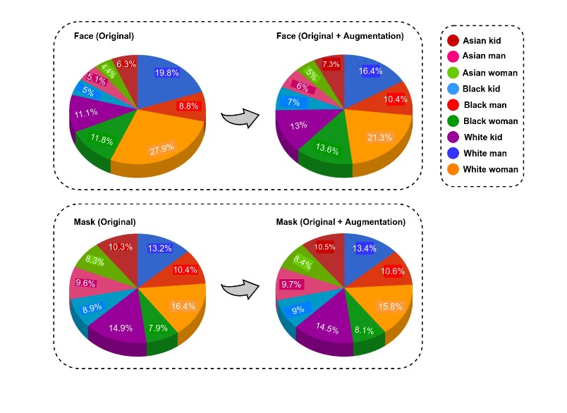

# UTFPR-FMD1 - Federal University of Technology - Paraná - Face Mask Dataset

Federal University of Techonology - Paraná

Authors: Clayton Kossoski, Gustavo H. S. Schaefer, Gianlucca Fiori, Heitor S. Lopes.

claytonutf@gmail.com

## Introduction

We developed a new face-mask dataset, namely UT-Face Mask Dataset 1 (UT-FMD1), focused on COVID-19 outbreak, which can be used to train computer vision models that check if a person is wearing face mask or not.

Is is designed to achieve, as deeply as possible, high quality in the following characteristics: class balancing, diversity of
people, variety of masks (shape, sizes, colors, real/fake), variety of accessories (glasses, beard), different lighting conditions, and poses.

To build this dataset, we used Selenium WebDriver and BeautifulSoap crawlers to get images from public and free share image repositories such as Pexels, Unsplash, and GettyImages using search queries (asian, black, white, woman, man, kid) and logical operators (and, or) in many combinations. Therefore, the image acquisition process is reproducible.

Keywords: face-mask dataset, balanced dataset, varied dataset.

## Dataset description

Dataset images and classes.

Originals

- face = 9027
    - man = 2558
        - white = 1758
        - black = 800

    - woman = 3531
        - white = 2487
        - black = 1044

    - kid = 1535
        - white = 1000
        - black = 535

    - asian = 1403
        - man = 457
        - woman = 388
        - kid = 558
 

- mask = 3899
    - man = 922
        - white = 516
        - black  = 406

    - woman = 951
        - white = 641
        - black = 310

    - kid = 928
        - white = 581
        - black = 347

    - asian = 1098
        - man = 373
        - woman = 323
        - kid = 402

-----------------------------------------

With Data Augmentation

- face = 30715
    - man = 8233
        - white = 5033    
        - black = 3200     

    - woman = 10730 
        - white = 6554    
        - black = 4176     

    - kid = 6140
        - white = 4000    
        - black = 2140     

    - asian = 5612
        - man = 1828     
        - woman = 1552    
        - kid = 2232    
 

- mask = 30715
    - man = 7376
        - white = 4128     
        - black  = 3248     

    - woman = 7331
        - white = 4851     
        - black = 2480      

    - kid = 7224
        - white = 4448     
        - black = 2776      

    - asian = 8784 
        - man =  2984     
        - woman = 2584     
        - kid = 3216    

## How to cite
@article{kossoski2022scalable,
  author  = {C. Kossoski and G. Schaefer and Gianlucca Fiori Oliveira and H. S. Lopes},
  title   = {A Scalable Analytics Pipeline for {COVID-19} Face Mask Surveillance},
  journal = {Learning \& Nonlinear Models},
  pages   = {62--73},
  publisher = {SBIC},
  year   = {2022},
  volume = {20},
  number = {1},
  doi    = {10.21528/lnlm-vol20-no1-art5}
}

## Licence

 This work is licensed under a <a rel="license" href="http://creativecommons.org/licenses/by-nc-nd/3.0/">Creative Commons Attribution-NonCommercial-NoDerivs 3.0 Unported License</a>.
